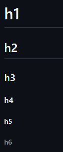
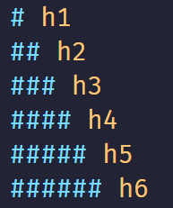

# Como é que se usa o README.md ?
> Feito por @arthurferreira-dev

O arquivo ``README.md`` é tipo uma **documentação técnica**, que é tipo de descrição sobre o projeto.

## Noções Básicas sobre o ``README.md``
### Cabeçalhos

Para que usa o ``HTML``, os cabeçalhos são as tags ``<h1></h1>``, ``<h2></h2>``, ``<h3></h3>``, ``<h4></h4>``, ``<h5></h5>`` e ``<h6></h6>``. <br>
Só que não estamos usando HTML no README.md certo?

>[!TIP]
>
> O ``README.md`` pode usar HTML sem problemas!

<br>

As tags em ``HTML`` podem ser substituídas por simples hashtags(#) antes de escrever algo. Veja os exemplos a seguir: <br>


<br>

<br>

### Um toque a mais nos seus ``Textos`` no README.md

Agora vamos aprender a formatar textos em MarkDown **(que é a extensão .md)**.

#### **Negrito**
```
    **Este é meu texto em Negrito**
```

Resultado: **Este é meu texto em Negrito**

<br>

#### *Itálico*
```
    *Este é um texto em Itálico*
```

Resultado: *Este é um texto em Itálico*

<br>

#### ***Negrito e Itálico***

```
    ***Este é um texto especial em Negrito e em Itálico***
```

Resultado: ***Este é um texto especial em Negrito e em Itálico***

Para ignorar os carácteres especiais que acabei de te mostrar, basta colocar ``\`` antes do carácter.

```
    \* Este não é mais um texto em Itálico \*
```

Resultado: \* Este não é mais um texto em Itálico \*

### Listas do tipos Numeradas ou Itens

Também em ``HTML`` temos isso com as tags, ``<ol></ol>`` e ``<ul></ul>``. <br>
So que em `MarkDown` temos os seguintes carácteres, ``1.`` e ``*``. Veja os exemplos a seguir: <br>

#### Lista Ordenada (em ordem)

1. Primeiro Item
1. Segundo Item
2. Terceiro Item
3. Quarto Item

Escrita: 
```
1. Primeiro Item
1. Segundo Item
2. Terceiro Item
3. Quarto Item
```

#### Lista Desordenada

* Item 1
* Item 41
* Item 2
* Item 65

Escrita:
```
* Item 1
* Item 41
* Item 2
* Item 65
```

### Tabelas

Tabelas são muuuito simples de serem feitas no ``.md``. Veja meu Exemplo: <br>

| Item | Preço |
| ---- | ----- |
| Bike | R$45 |
| Fusca | R$1.000 |
| PS6 | R$150 |

Escrita: 
```
| Item | Preço |
| ---- | ----- |
| Bike | R$45 |
| Fusca | R$1.000 |
| PS6 | R$150 |
```

>[!WARNING]
>
> Não se esqueça do espaço e o fechamento entre o `|` e seu texto!

### Bloco de Notas

Os Bloco de Notas servem para deixar um lembrete e chamar a atenção de que estiver lendo. Veja alguns a seguir: <br>

* [!TIP]
* [!NOTE]
* [!IMPORTANT]
* [!CAUTION]
* [!ADMINISTRATION]
* [!ERROR]
* [!AVAILABILITY]
* [!PREREQUISITES]
* [!INFO]
* [!SUCCESS]

No geral em si, os blocos de notas devem ter uma moderação quando usados, porquê podem causar problemas, eles devem estar entre `[]` e ter uma `!` nos colchetes. <br>
Os blocos de notas são uteís pois suportam bloco de códigos os `6 desses ``````` `, links. imagens e listas, tente deixar eles simples e o mais direto possível.

### Vídeos

O `MarkDown` não renderiza vídeos nativamente, mas usando uma extensão até funciona.

>[!VIDEO](https://video.tv.adobe.com/v/29770/?quality=12)

### Links

Como no HTML temos a tag `<a href=""></a>`, no MarkDown temos os carácteres `[texto do link](url)` juntos. Veja alguns exemplos:

* [Landing Page Lanchonete](https://github.com/arthurferreira-dev/Landing-Page-Lanchonete)
* [Discord](https://discord.com/)

Escritas:
```
[Landing Page Lanchonete](https://github.com/arthurferreira-dev/Landing-Page-Lanchonete)
[Discord](https://discord.com/)
```

### TaskList

No `MarkDown` temos as lista desordenadas e ordenadas, mas nós também temos as TaskLists.

 - [x] Escrita do `README.md`
 - [:] Discord
  - [x] Algo a mais...